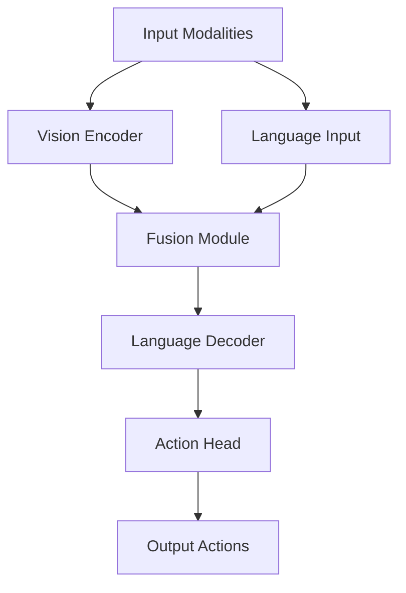

# FastVLA Architecture Deep-Dive

## Overview
This document outlines the architecture of the FastVLA (Vision-Language-Action) model integration into Unsloth, optimized for constrained hardware environments.

## System Architecture

## Components

### 1. Vision Encoder
- **Input**: Multi-camera RGB/Depth frames
- **Architecture**: Pre-trained ViT (Vision Transformer)
- **Output**: Visual tokens (sequence of vectors)
- **Optimizations**:
  - 4-bit quantization
  - Gradient checkpointing
  - Tensor parallelism for multi-GPU

### 2. Language Decoder
- **Input**: Text tokens + Visual tokens
- **Architecture**: Pre-trained LLM (e.g., LLaMA 7B)
- **Output**: Next token predictions
- **Optimizations**:
  - 4-bit quantization (QLoRA)
  - Flash Attention 2
  - PEFT (Parameter-Efficient Fine-Tuning)

### 3. Fusion Module
- **Input**: Visual tokens + Text tokens
- **Architecture**: Cross-attention layers
- **Output**: Fused multi-modal representations
- **Optimizations**:
  - Custom Triton kernels
  - Memory-efficient attention

### 4. Action Head
- **Input**: Decoder hidden states
- **Output**: Robot actions (joint positions, gripper commands)
- **Architecture**: MLP with residual connections
- **Optimizations**:
  - Mixed precision (FP16)
  - Kernel fusion

## Data Flow

1. **Input Processing**
   - Images → Vision Encoder → Visual tokens
   - Text → Tokenizer → Text tokens

2. **Multi-modal Fusion**
   - Visual + Text tokens → Fusion Module → Fused representations

3. **Action Prediction**
   - Fused representations → Language Decoder → Action Head → Robot commands

## Memory Management

### Quantization
- 4-bit weights (NF4)
- 16-bit activations
- 8-bit optimizers

### Memory-Efficient Techniques
- Gradient checkpointing
- Activation offloading
- CPU offload for large tensors

## Performance Targets

| Metric              | Target           |
|---------------------|------------------|
| VRAM Usage (2×T4)   | ≤ 12GB per GPU   |
| Throughput          | ≥ 1.9 samples/s  |
| Training Time (1k steps) | ≤ 2.1 hours |
| Accuracy Drop       | ≤ 1% vs FP32     |

## Integration Points

1. **Hugging Face Transformers**
   - Custom model class: `FastVLAModel`
   - Tokenizer extensions for multi-modal inputs

2. **Unsloth Optimizations**
   - Custom kernels for attention
   - Memory-efficient training loop
   - Mixed precision support

3. **Robotics Middleware**
   - ROS 2 interface
   - Action server/client for real-time control

## Open Questions

1. Exact architecture of the fusion module
2. Optimal attention patterns for long sequences
3. Quantization-aware training requirements
4. Multi-GPU communication patterns

## Next Steps

1. [ ] Finalize model architecture
2. [ ] Set up development environment
3. [ ] Implement baseline model
4. [ ] Profile and optimize
5. [ ] Integrate with Unsloth
